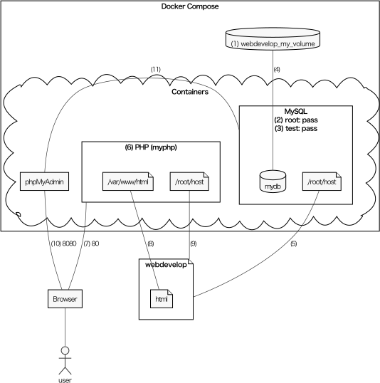
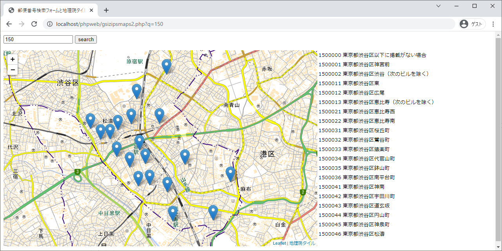

# Dockerを使うウェブアプリケーション開発環境（PHP）

MySQL，PHP，phpMyAdminのDockerコンテナを組み合わせて，ウェブアプリケーションの開発環境を構築します．

- Dockerの使い方は，[辻真吾・矢吹太朗『ゼロからはじめるデータサイエンス入門』（講談社, 2021）](https://github.com/taroyabuki/fromzero)を参照してください．ただし，この書籍ではここで使っているDocker Composeについては説明していないので，Docker Composeについては別の資料があるといいでしょう．例：大澤文孝・浅居尚『さわって学ぶクラウドインフラ　docker基礎からのコンテナ構築』（日経BP, 2020）
- ウェブアプリケーションの構築方法については，[矢吹太朗『ウェブアプリケーション構築入門』（森北出版, 2011）](https://github.com/taroyabuki/webbook2)を参照してください．

## 概要

[](figure.md)

詳細は[docker-compose.yml](docker-compose.yml)を参照．

1. Dockerのボリューム`webdevelop_my_volume`を作る．作り直したいときは`docker volume rm webdevelop_my_volume`．ちなみに，ボリュームの一覧表示は`docker volume ls`，全ボリュームの削除は`docker volume prune`．
2. MySQLのユーザrootのパスワードは`pass`．
3. MySQLのユーザtestのパスワードは`pass`．
4. 1のボリュームにデータベース（mydb）を保存する．ユーザtestはこのデータベースにアクセスできる．
5. ホストのディレクトリwebdevelopとコンテナの/root/hostは同じ．
6. PHPは，イメージphp:7.2-apacheを元に作った独自のもの（myphp/Dockerfileを参照）．
7. ホストのwebdevelop/htmlとコンテナの/var/www/htmlは同じ．
8. ホストのディレクトリwebdevelopとコンテナの/root/hostは同じ（5と同様）．
9. localhost:80へのアクセスはPHPに転送される．
10. localhost:8080へのアクセスはphpMyAdminに転送される．
11. phpMyAdminの管理対象はMySQL（参照：https://hub.docker.com/r/phpmyadmin/phpmyadmin/ ）

## 準備

1. （Windows）WSL2を有効にする（ここではUbuntuを仮定）．
1. （Windows）WSL2のUbuntuでgitをインストールする．
1. Docker Desktopをインストールする．
1. 適当な作業ディレクトリで，リポジトリをクローンする．（Windowsでは，Ubuntuのシェルを使う．）

```bash
cd # ここではホームディレクトリを仮定
git clone https://github.com/taroyabuki/webdevelop.git
```

Docker Composeをインストールします．
Windowsでは，Ubuntuのシェルで次のコマンドを実行します．

```bash
sudo apt update
sudo apt install -y python3 python3-pip
sudo pip3 install docker-compose
```

### VS Code（オプション）

必須ではありませんが，Visual Studio Codeを入れて，サイドバーのExtension（Ctrl+Shift+X）で，`Remote Development`と入力し，Remote Developmentをインストールしておくと便利です．たとえば，ホスト側にPHPを入れていなくても，コンテナのPHPを使って編集中のPHPコードの文法をチェックできます（後述）．

## 起動と停止

ポート80を使うアプリ（例：Skype）を終了させてから，次を実行します．

```bash
cd webdevelop
docker-compose up -d
```

構築した環境を停止する方法は次のとおりです．

```bash
docker-compose down
```

## 動作確認

ウェブサーバのドキュメントルートはhtmlです．info.phpやdb.phpはこのフォルダにあります．

* [PHPの動作確認：http://localhost/info.php](http://localhost/info.php)
* [データベースへの接続確認：http://localhost/db.php](http://localhost/db.php)（何も表示されなければ成功）
* [phpMyAdmin: http://localhost:8080/](http://localhost:8080/)（ユーザ名：`root`，パスワード：`pass`．または，ユーザ名：`test`，パスワード：`pass`）

## 各コンテナでの作業

各コンテナで作業する方法は次のとおりです．いずれも`exit`で終了．

* MySQLが動作しているサーバを操作したい：`docker-compose exec mysql bash`．ホスト側のファイルは/root/hostでアクセスできる（`docker-compose exec mysql ls /root/host`で確認）．
* MySQLを操作したい：`docker-compose exec mysql mysql -uroot -ppass`
* ウェブサーバを操作したい：`docker-compose exec php bash`．ホスト側のファイルは/var/hostや/var/www/htmlでアクセスできる（`docker-compose exec php ls /var/www/html`で確認）．

Visual Studio CodeのRemote Developmentを使うと，コンテナのPHPを使って編集中のPHPコードの文法をチェックする方法は次のとおりです．

1. Ctrl+Shift+P，「Remote-Containers: Attach to Running Container...」でPHPが動作するコンテナ（/webdevelop_php_1）に接続する．
1. File→Open Folderで「/var/www/html」を開く．
1. PHPファイルを開いて編集する．
1. ファイルを保存する．（このとき，文法のチェックが行われる．）

## カスタマイズ

三つのイメージ（mysql:5.7，phpmyadmin/phpmyadmin，php:7.2-apache）を使っています．
カスタマイズしているのはphp:7.2-apacheだけなので，追加のカスタマイズもこれに対してするといいでしょう．
変更をmyphp/Dockerfileに記述してから，次を実行してください．

```bash
docker-compose down
docker build -t webdevelop_php myphp
docker-compose up -d
```

## サンプルアプリケーション

矢吹太朗『ウェブアプリケーション構築入門』（森北出版, 2011）のサンプルを試します．

### 4.5.1 指定した位置（緯度・経度）を中心とする地図

（使いにくくなった）Google Maps APIの代わりに地理院タイルとLeafletを使います．

- [地理院タイルを用いたサイト構築サンプル集](https://maps.gsi.go.jp/development/sample.html)
- [Leaflet API reference](https://leafletjs.com/reference.html)

googlemaps.htmlの地理院タイル版がhtml/phpweb/gsimaps.htmlです．

[動作確認：http://localhost/phpweb/gsimaps.html](http://localhost/phpweb/gsimaps.html)

### 4.5.2 指定した住所を中心とする地図

[Yahoo!ジオコーダAPI](https://developer.yahoo.co.jp/webapi/map/openlocalplatform/v1/geocoder.html)で住所から位置（緯度と経度）を求めます．[アプリケーションID](https://e.developer.yahoo.co.jp/register)を作ってから先に進んでください．

このAPIはJSONPで呼び出します．JSONPについては第5章章末のコラム（p.75）を参照してください．

addressmaps.htmlの地理院タイル版がhtml/phpweb/gsiaddressmaps.htmlです．

[動作確認：http://localhost/phpweb/gsiaddressmaps.html](http://localhost/phpweb/gsiaddressmaps.html)

### 9.1 郵便番号データベース

郵便番号データをダウンロードします．

```bash
docker-compose exec php bash -c "\
cd /root/host
rm -f ken_all.zip jigyosyo.zip KEN_ALL.CSV JIGYOSYO.CSV
curl -O https://www.post.japanpost.jp/zipcode/dl/oogaki/zip/ken_all.zip &&\
curl -O https://www.post.japanpost.jp/zipcode/dl/jigyosyo/zip/jigyosyo.zip &&\
unzip ken_all.zip &&\
unzip jigyosyo.zip"
```

郵便番号データをMySQLにインポートします．

```bash
docker-compose exec mysql bash -c "cd /root/host && mysql -uroot -ppass mydb < zips.sql"
```

### 9.2.3 GETによる検索の動作確認と改良

[動作確認：http://localhost/phpweb/zips.php?q=150](http://localhost/phpweb/zips.php?q=150)

この段階では文字化けしてもかまいません．

### 9.4 Google Maps APIとのマッシュアップ

zipsmap.phpの地理院タイル版がhtml/phpweb/gsizipsmaps.phpです．

[動作確認：http://localhost/phpweb/gsizipsmaps.php?q=150](http://localhost/phpweb/gsizipsmaps.php?q=150)

[おまけ（マーカー表示）：http://localhost/phpweb/gsizipsmaps2.php?q=150](http://localhost/phpweb/gsizipsmaps2.php?q=150)



書籍に合わせて，[Yahoo!ジオコーダAPI](https://developer.yahoo.co.jp/webapi/map/openlocalplatform/v1/geocoder.html)で住所から位置を求めています．[郵便番号検索API](https://developer.yahoo.co.jp/webapi/map/openlocalplatform/v1/zipcodesearch.html)で郵便番号から位置を求めてもいいでしょう．

### 9.5 Ajaxによるリアルタイム検索

zipsajaxmap.phpのYahoo!地図版がhtml/phpweb/gsizipsajaxmaps.phpです．

[動作確認：http://localhost/phpweb/gsizipsajaxmaps.php](http://localhost/phpweb/gsizipsajaxmaps.php)

## ライセンス

Copyright (c) 2022 Taro Yabuki

Released under the [MIT license](LICENSE)
