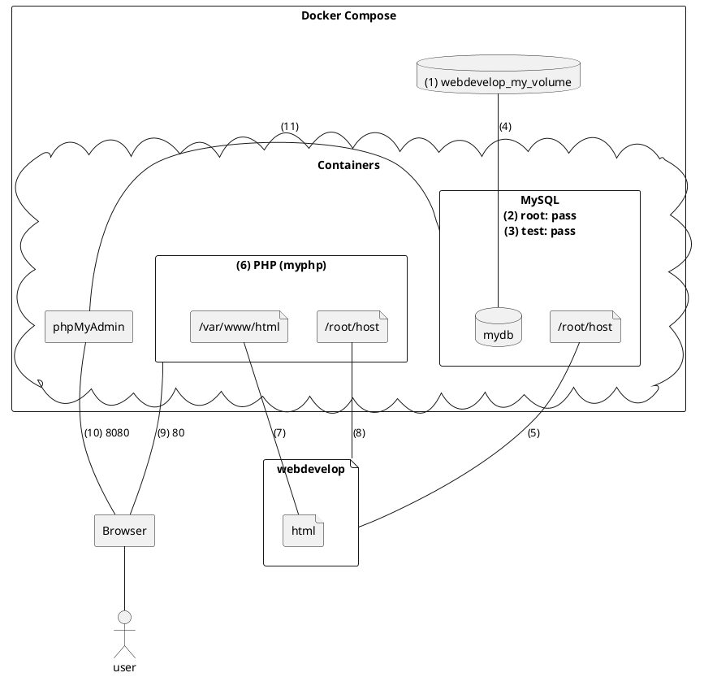

```puml
@startuml
skinparam {
  defaultFontName Hiragino Kaku Gothic ProN
  monochrome true
  shadowing false
}

rectangle Docker as "Docker Compose" {
  cloud containers as "Containers" {
    rectangle php as "(6) PHP (myphp)" {
      file phpfile1 as "/root/host"
      file phpfile2 as "/var/www/html"
    }
    rectangle mysql as "MySQL\n(2) root: pass\n(3) test: pass" {
      file mysqlfile as "/root/host"
      database mydb as "mydb"
    }
    rectangle phpmyadmin as "phpMyAdmin"
  }
  database volume as "(1) webdevelop_my_volume"
}
rectangle browser as "Browser"
actor user
file webdevelop {
  file html
}

user-up-browser
browser-up-php:(9) 80
browser-up-phpmyadmin:(10) 8080

mydb-up-volume:(4)

webdevelop-up-mysqlfile:(5)
webdevelop-up-phpfile1:(8)
html-up-phpfile2:(7)
phpmyadmin-mysql:(11)

@enduml
```